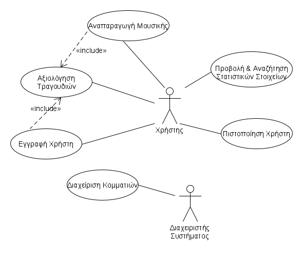

# Song For Your Mood App 

## Περιγραφή Απαιτήσεων 

Η εφαρμογή μας θα ικανοποιεί τις παρακάτω απαιτήσεις:
* Εξασφάλιση της ασφάλειας και της αξιοπιστίας της εφαρμογής κατά τη διαχείριση των προσωπικών στοιχείων και δεδομένων των χρηστών χρησιμοποιώντας κρυπτογράφηση για την αποθήκευση τους.
* Πιστοποίηση των εγγεγραμμένων χρηστών κατά την σύνδεση τους στην εφαρμογή, ώστε να διαχωρίζονται από τους μη εγγεγραμένους.
* Λειτουργίες όπως η αξιολόγηση τραγουδιών, η εμφάνιση προτεινόμενων κομματιών και η αναπαραγωγή τραγουδιών να επιτρέπονται μόνο στους εγγεγραμμένους χρήστες.
* Εύχρηστη, απλή και κατανοητή διεπαφή χρήστη.
* Να εμφανίζονται κατάλληλα ενημερωτικά μηνύματα που θα πληροφορούν τον χρήστη ότι ολοκληρώθηκε η διαδικασία ταυτοποίησης του ή για συμπλήρωση μη έγκυρων στοιχείων.
* Η διαδικασία εγγραφής του χρήστη θα περιλαμβάνει αξιολόγηση 5 κομματιών που θα προέρχονται από τα αγαπημένα συγκροτήματα και 5 κομματιών που θα εμπίπτουν στα αγαπημένα είδη μουσικής του.
* Η διαδικασία απάντησης ερωτήσων γίνεται κατά την σύνδεση αποτελείται από τα παρακάτω κριτήρια και τις ακόλουθες επιλογές:
  * Τι διάθεση έχεις;
     * Επιλογές: "Χαρούμενη", "Λυπημένη", "Θυμωμένη", "Νοσταλγική", "Αγχωμένη" και "Ήρεμη". 
  * Τι δραστηριότητα κάνεις;
     * Επιλογές: "Δουλειά", "Διάβασμα", "Γυμναστική", "Πάρτυ", "Χόμπυ" και "Δεν θα κάνω κάποια δραστηριότητα" 
  * Επιλέξτε ένα είδος μουσικής.
     * Επιλογές: "Jazz", "Rock", "Pop", "Disco", "Rap" και "Classical"
  * Επιλέξτε ένταση κομματιού.
     * Επιλογές¨: "Δυνατό", "Μέτριο" και "Χαλαρό"
* Η διαδικασία αξιολόγησης ενός κομματιού γίνεται κατά την διάρκεια της εγγραφής και κατά τη διάρκεια της αναπαραγωγής ενός κομματιού, εφόσον το επιθυμεί ο χρήστης, και αποτελείται από τα παρακάτω:
  * Τι διάθεση έχει το κομμάτι;
     * Επιλογές: "Χαρούμενη", "Λυπημένη", "Θυμωμένη", "Νοσταλγική", "Αγχωμένη" και "Ήρεμη". 
  * Σε ποια δραστηριότητα θα το άκουγες;
     * Επιλογές: "Δουλειά", "Διάβασμα", "Γυμναστική", "Πάρτυ", "Χόμπυ" και "Δεν θα κάνω κάποια δραστηριότητα" 
  * Τι ένταση έχει το κομμάτι;
     * Επιλογές¨: "Δυνατό", "Μέτριο" και "Χαλαρό"
* Για να γίνει επιτυχής εμφάνιση προτεινόμενων κομματιών και αξιολόγηση ενός κομματιού να πρέπει να απαντηθούν όλα τα κριτήρια αξιολόγησης που θέτει η εφαρμογή.
* Κατά τη διαδικασία της αξιολόγησης και της απάντησης ερωτήσεων τα κριτήρια και οι επιλογές του χρήστη πρέπει να είναι σαφείς. Για παράδειγμα, να διατυπώνεται με σαφήνεια το κριτήριο "Επιλέξτε την ένταση του κομματιού."/ "Τι ένταση έχει το κομμάτι;", καθώς και ότι οι επιλογές που δίνονται είναι "Δυνατό", "Μέτριο" και "Χαλαρό". 
* Ένα κομμάτι θα προτείνεται εφόσον συμφωνεί με τα κριτήρια του χρήστη και δεν έχει ακουστεί από τον χρήστη τις τελευταίες 5 ώρες.
* Να υπολογίζονται με ακρίβεια τα στατιστικά στοιχεία κάθε κομματιού ανάλογα με τις επιλογές όλων των χρηστών. 
* Αν το 60% των αξιολογήσεων θεωρεί ότι το κομμάτι αντιστοιχεί σε μια συγκεκριμένη διάθεση, για παράδειγμα χαρούμενη, τότε θα θεωρούμε ότι ταιριάζει με την επιλογή διάθεση = χαρούμενη.
* Η προβολή των στατιστικών στοιχείων και η αναζήτηση με διάφορα κριτήρια (τίτλος κομματιού, συγκρότημα, είδος), δηλαδή να  βλέπουν για κάθε επιλεγμένο κομμάτι στατιστικά όσον αφορά τις αξιολογήσεις των χρηστών για τα 3 κριτήρια διάθεσης, να επιτρέπεται και σε μη εγγεγραμμένους χρήστες.

## Σύντομη Περιγραφή των Περιπτώσεων Χρήσης

#### [ΠΧ 1 Εγγραφή Χρήστη](uc1-user-registration.md): 
Ο χρήστης συμπληρώνει ονοματεπώνυμο, e-mail, username, password, τις μουσικές προτιμήσεις του και αξιολογεί 2 κομμάτια που θα προέρχονται από τα αγαπημένα του συγκροτήματα και 2 κομμάτια που θα εμπίπτουν στα αγαπημένα είδη μουσικής του.

#### [ΠΧ 2 Πιστοποίηση Χρήστη](uc2-user-identification.md): 
Ο χρήστης συμπληρώνει username και password, και εαν τα στοιχεία είναι έγκυρα, συνδέεται στην εφρμογή.

#### [ΠΧ 3 Αναπαραγωγή Μουσικής](uc3-music-playing.md):
Ο χρήστης απαντάει στις 4 προαναφερθείσες ερωτήσεις και του εμφανίζεται μια λίστα τραγουδιών που ταιριάζουν στις απαντήσεις που έδωσε, από τις οποίες μπορεί να επιλέξει το κομμάτι που επιθυμεί πατώντας στον σύνδεσμο. Ο χρήστης έχει, επίσης, τη δυνατότητα να αξιολογήσει ένα κομμάτι.

#### [ΠΧ 4 Αξιολόγηση Τραγουδιών](uc4-song-rating.md): 
Ο χρήστης απαντάει στις 3 προαναφερθείσες ερωτήσεις σχετικά με το κομμάτι που αξιολογεί και οι απαντήσεις καταγράφονται στο συστήμα. Αυτή η διαδικασία πραγματοποιείται κατά την εγγραφή του χρήστη για 10 κομμάτια και κατά την αναπαραγωγή κομματιών, εφόσον ο χρήστης το επιλέξει.

#### [ΠΧ 5 Προβολή και Αναζήτηση Στατιστικών Στοιχείων](uc5-projection-and-search-of-statistics.md):
Ο χρήστης (εγγεγραμμένος ή μη) επιλέγει χωρίς ή με βάση κάποιο κριτήριο (τίτλος κομματιού, συγκρότημα, είδος) να δει τα στατιστικά στοιχεία των κομματιών της εφαρμογής.

#### [ΠΧ 6 Διαχείριση Κομματιών](uc6-song-addition.md):
Ο διαχειριστής εμπλουτίζει τη βάση δεδομένων του συστήματος με κομμάτια, τα οποία συνοδεύονται από πληροφορίες που θα υποστηρίζουν τη λειτουργία της εφαρμογής (είδος μουσικής, καλλιτέχνης, έτος παραγωγής, τίτλος κτλ).

## [Domain Model & Προδιαγραφές για τις μη λειτουργικες απαιτήσεις](docs/markdown/software-requirements.md)